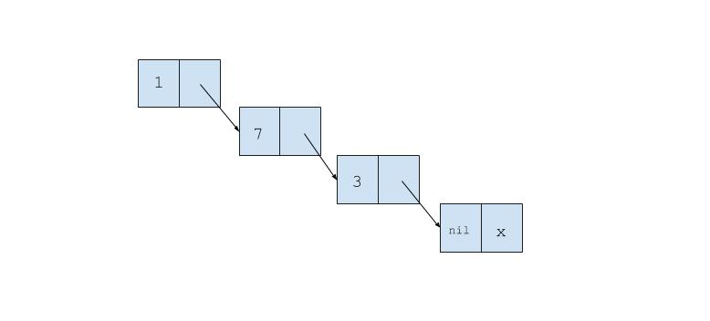

# Implementing the Pair Class 

Scheme is a programming language. It is a dialect of [Lisp](https://en.wikipedia.org/wiki/Lisp_(programming_language)) which is one of the oldest programming languages that is still used today. 

One of the fundamental constructs of Scheme is a **pair** or 2-tuple. In Scheme we can denote a 2-tuple with the `cons` keyword.

```scheme
(define y (cons 3 4))
```

The `define` keyword is how we create variables in Scheme. You can think of the above code as creating a variable named `y` that is bound to the 2-tuple `(3,4)`. If we want to access the first element of `y` we can use the `car` keyword and if we want to access the second element of `y` we can use the `cdr` keyword. The `car` and `cdr` keywords are built-in to Scheme.

Using `y` above:

```scheme 
(define y (cons 3 4))
(car y) # Evaluates to 3 
(cdr y) # Evaluates to 4
```

We can create a recursive list by nesting pairs within pairs like so: 

```scheme
(cons 1
    (cons 7
        (cons 3 nil)))
```

The nested list above is a [**linked list**](https://www.cs.cmu.edu/~adamchik/15-121/lectures/Linked%20Lists/linked%20lists.html) and can be diagrammatically represented like so:



Below is an implementation of a Pair. Note that this is really just a linked list.

```ruby
class Pair 

	def initialize(first, second)
		@first = first 
		@second = second
	end 

	def map(&cb)
		mapped = cb.call(@first)
		if @second.nil?
			return Pair.new(mapped, nil)
		elsif @second.instance_of? Pair 
			return Pair.new(mapped, @second.map(&cb))
		end
	end

	def length
		# Your code here
	end
end

first = Pair.new(8, Pair.new(4, Pair.new(2, nil)))
puts first.map(&Proc.new{ |x| x*x }).inspect #run this code to see sample output of map
```

Your task is to write a method called `length` on the above class that determines how many nodes the linked list has.

For example,

```ruby
first = Pair.new(8, Pair.new(4, Pair.new(2, nil)))
first.length #=> Should return 3 
```
### Further Study

If you are curious about Scheme and want to learn more I suggest you [download the Scheme compiler](https://stackoverflow.com/questions/12322434/how-to-install-mit-scheme-on-mac) and do [this](http://www.shido.info/lisp/idx_scm_e.html) Scheme tutorial. 

