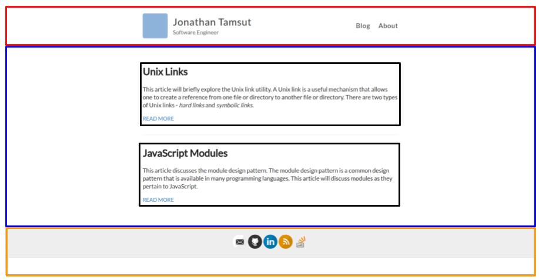

## CSS Layouts

Slides for this set of lecture notes can be found [here](https://presentations.generalassemb.ly/f0c0027ec8dcc21c721a52cc8b94a4d7#/).

---

### CSS Inspiration 

Let's get inspired [here](https://100dayscss.com/).

---

## Boxes! They're Everywhere!

HTML elements are rendered as boxes on a web page. In fact all web pages can be thought of as being a series of boxes: boxes stacked on top of each other, boxes placed next to one another and boxes nested inside one another.

---

## A Box is Defined by Some HTML Elements



---

## The Box Model and its Components


* **Margin** - white space around box (values are top, right, bottom, left)
* **Border** - solid/dashed line around padding (values are top, right, bottom, left)
* **Padding** - area between content and border (values are top, right, bottom, left)
* **Content** - contents of box (e.g., text or an image)

<p>Units can be pixels, % or ems.</p>

---

## Viewing a Box in DevTools

We can see this box using DevTools. Let's look at [my](http://www.jtamsut.com/) site's boxes using DevTools.

---

#### Central Idea Behind the Box Model

**Take home: The border width/height, content width/height, padding width/height and margin width/height determine the dimensions of a box**.

---

#### How are CSS Values Written

Let's take a look at the possible values for padding [here](http://cssreference.io/property/padding/).

---

## What's the Padding?

What is the value of left padding on the `red` class? What about the top, bottom and right value?

What about `margin` values?

```css
.red {
  height: 50px;
  width: 50px;
  background: red;
  padding: 25px 100px 35px 10px;
  margin: 20px 10px;
}
```

---

#### Add a Margin and a Padding

Adjust the margin and padding value [here](https://codepen.io/jtamsut/pen/WOjodE).

---

##### How Do We Center?

How do we center elements using CSS? `margin`, that's how! What is the rule that is making the `div` with class `container` centered on www.jtamsut.com? 


---

### How We Center

We center with `margin: 0 auto`.

---

### You Bored?

Turn down for [whatttttt](https://nthitz.github.io/turndownforwhatjs/).

---

## Box-Sizing   

`box-sizing` is an interesting property. By default it's set to `content-box`, but we often assume sizing works in terms `border-box`. The difference is subtle, but important. 

Let's take a peak at the differences [here](http://cssreference.io/property/box-sizing/).

---

## Now You Try

What is the "equation" when `box-sizing` is set to `border-box`?

By "equation" I mean, what values do we add up to get the width of an element?

Spend a few minutes testing it out here: https://codepen.io/jtamsut/pen/yMvQOb.

---

## Display


* **inline**: no line break; elements can't be given a width
* **block**: elements take entire width of parent element
* **inline-block**: like inline element but you can specify width
* **none**: element doesn't appear on page

---

## Display Visually

Let's take a look at the display property [here](http://cssreference.io/property/display/).

---

### Playin' Round

Take some time to play around with [this](https://codepen.io/jtamsut/pen/PjmzLd) Code Pen.

* By default what determines the width of an `inline` element?
* By default what is the width of a `block` element?
 
---

## Positioning

The `position` property in CSS allows the content to move around the page in four separate fashions: `static`, `relative`, `absolute`, and `fixed`.

---

## Static Positioning

HTML elements are `position: static` by default. A "static positioned" element is always positioned according to the normal flow of the page and are not affected by the `top`, `bottom`, `left`, and `right` properties.

---
## What is top you ask?

Let's illustrate top: https://codepen.io/jtamsut/pen/OpvNOr

---

## Relative Positioning

Declaring `position: relative` allows you to position the element top, bottom, left, or right relative to where it would normally occur.

---

## Absolute Positioning

Setting `position: absolute` on an element lets you position it according to the edges of its parent element. This has the side effect of removing it from
the flow – that is, other elements will act like it isn't there.

---

## Fixed Positioning

An element with `position: fixed` is positioned relative to the edges of the browser window.  It will not move even if the window is scrolled, so a fixed
positioned element will stay right where it is.

---

## CSS Directions

Related to the `position` property, the `left`, `right`, `top`, and `bottom`
properties are known as the CSS Directions. By Default, they're set to `auto`,
and these properties do nothing while `position: static;`. They move an element
by adding a pixel amount to the respective direction between it and the *nearest*
element or border.

---

## Match the Designs

Make [this](https://codepen.io/jtamsut/pen/bqLQOq) CodePen look like this:


Spend 10 minutes with a partner.

---

## Floats

The `float` propery determines which side of the browser an element should appear and whether or not it should contain its own line


---

### Let's Take a Look at Floats

Let's take a look at some floatey action [here](https://codepen.io/jtamsut/pen/bRWgPZ).

---

## Grid System


---

## Grid System 

Take some time to play around with [this](https://codepen.io/jtamsut/pen/yXbgrL?editors=1100).

What did you notice about this CSS?

---

## What Else is Out There?

Use a CSS framework like [Semantic UI](https://semantic-ui.com/) or [Bootstrap](http://getbootstrap.com/)

---

## Mo' Stuff

Do [this](http://learnlayout.com/no-layout.html) or [this](https://flukeout.github.io/).