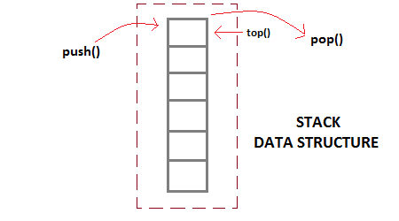

# Introduction to Data Structures in Ruby

Pedagogical goal: Be able to use object-orientated concepts in Ruby to implement fundamental data structures and be introduced to basic Computer Science concepts.


## Introduction 

**Data structures** are abstract representations of the structure and relationsips between data. We are going to be implementing a few fundamental data structures in Ruby to gain practice with Ruby and learn computer science. We will be implementing the following data structures: 

    1. Stack
    2. Queue
        * Implement queue & dequeue methods on the Queue class
    3. Graph 
    4. Binary Search Tree
        * Implement find_node method on BinaryTreeNode class

### Stacks and Queues

A **stack** is a data structure in which items are added and removed in *last in, first out* (LIFO) order. Below is a picture of a stack: 



A **queue** is basically just a line like one you wait in to check-out at a grocery store. Items that are added to the queue are removed in the order in which they were added. Below is a picture of a queue: 


### Graph and Binary Search Tree 

**Graphs** are a very useful data structure. They can be used to model social networks, computer network or even roads in a city. Graphs are a data structure comprised entirely of only two components:

* Edges
* Nodes or Vertices


A **Binary Search Tree** is a data structure comprised of nodes and edges that connect nodes. Here is a diagram of a binary search tree:


Some terms you should be aware of: 

* Each one of the circles in the above diagram are called **nodes**
* A node that is directly above another node is called a **parent node**
* A node that is immediately below another node is called a **child node**
* The lines that connect the nodes are called **edges**

There are some rules a Binary Search Tree obeys:

    1. The values of the nodes in the left subtree are less than the values of the parent node
    2. The value of the nodes in the right subtree are less than the values of the parent node
    3. There are no nodes with the same values

## Exercises 

Inside of the `data-structures` directory there are four Ruby files: 

    * stack.rb
    * queue.rb
    * graph.rb
    * binary_search_tree.rb

`stack.rb` and `graph.rb` are *finished* Ruby implementations of Stack and Graph data structures, respectively. Please spend some time reading through this code and testing it out to fully understand how it works.

Your task is to finish `queue.rb` and `binary_search_tree.rb`. 
    
##### Tasks to Finish Queue 

* For `queue.rb` implement the `enqueue` and `dequeue` methods 
* `enqueue` should add an item to the Queue and `dequeue` should remove an item from the front of the Queue 

##### Tasks to Finish Binary Search Tree 

* Please first look through the `binary_search_tree.rb` code to understand how the code works 
* Write a method on the `BinaryTreeNode` class called `find_node` that 
accepts a value and returns `true` if a node with that value exists and `false` 
otherwise. This algorithm should start at the top-most node called the **root** node 
and should traverse the tree until it either finds a node with a given value or
reaches a bottom or **leaf** node.

## Bonus 

If you finish the exercises above do these. 

#### Invert a Binary Search Tree

Invert a binary tree. This should be a method on the `BinaryTreeNode` class.

Go from this: 

```
     4
   /   \
  2     7
 / \   / \
1   3 6   9
```

to this: 

```
    4
   /   \
  7     2
 / \   / \
9   6 3   1
```

#### Determine if a Binary Tree is Symmetric 

Write an algorithm to determine if a binary tree is symmetric. This should be a method on the `BinaryTreeNode` class.

This is symmetric:

```
     1
   /   \
  2     2
 / \   / \
3   4 4   3
```

This is not symmetric: 

```
    1
   / \
  2   2
   \   \
   3    3
```

#### Remove Duplicates

Write a Ruby method called `remove_duplicates` that removes duplicates from an array. This method should accept an array of integers as its argument and should return a *new* array with all duplicate integers removed. The order of the elements in the returned array does not matter.

For example, 

```ruby
remove_duplicates [1,1,2,3] #=> [1,2,3]
remove_duplicates [1,6,3,9,2,4,3,9,1] #=> [1,2,3,4,6,9]
```


