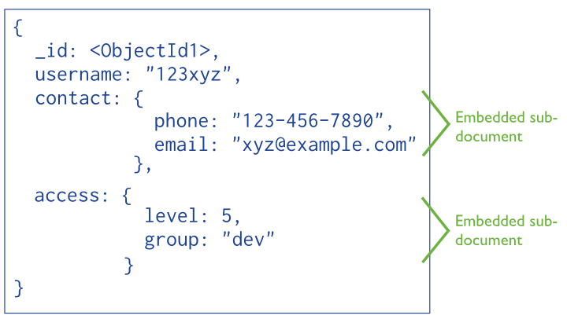

# Data Modeling with MongoDB

This lecture reviews embedding and referencing in MongoDB and provides a tutorial for how to implement these associations using the Mongoose Object Document Mapper (ODM). We will also get further practice building RESTful CRUD applications using Express and Mongoose. 

## What is Data Modeling?

An effective data model is one that allows you to access data from your database *quickly* and *easily*.

## Learning Objectives

By the end of this lecture students should be able to:

* Understand the difference between **embedding** and **referencing** in MongoDB
* Know how to implement a one-to-many association in Mongoose using both embedding and referencing
* Know how to use the `populate` method to access referenced documents

## Review

* Data in MongoDB has a flexible schema
* Unlike SQL databases where you must determine and declare a table’s schema before inserting data, MongoDB’s collections do not enforce document structure

## Normalized vs. Denormalized Data

Roughly speaking a **normalized** data set has no redundant data, while **denormalized** data has some duplicates of data.

## Recap: References vs Embeds

#### References

**References** store the relationships between data by including links or references from one document to another. Applications can resolve these references in multiple queries to access the related data. 

Broadly, these are normalized data models.


#### Embedded Data

**Embedded** documents capture relationships between data by storing related data in a single document structure. MongoDB documents make it possible to embed document structures in a field or array within a document. These denormalized data models allow applications to retrieve and manipulate related data in a single database operation.



### A Longform Tutorial

We are going to be building an application to learn about embedding and referencing using Mongoose.

#### Application Description

This application will have two models: 

1. Posts
2. Users. 

There will be a one-to-many relationship between users and posts. The Entity-Relationship Diagram for this model is below:


### Application: Embedding 

> As a class: Let's write our routes for this application on the board.

We will first build an Express application using embedding.

#### Embedding Subdocument: A Little Theory

A document embedded inside of another document is called a **subdocument**. The easiest and probably most common way to create a one-to-many association using Mongoose is through embedding. 

Let's consider an example. With this approach we embed *schemas* within *schemas*. Let's consider a `Blogpost` schema that has many `Comments`:

Emdedding documents using Mongoose:

```javascript
var Comments = new Schema({
    title     : String,
    body      : String,
    date      : Date
}, {
    timestamps: true
});

var BlogPost = new Schema({
    author    : ObjectId,
    title     : String,
    body      : String,
    date      : Date,
    comments  : [Comments],
}, {
    timestamps: true
});

mongoose.model('BlogPost', BlogPost);
```

We use square brackets `[<Schema Name>]` to denote that many `Comments` are in a single `BlogPost`.

This is how you *add* an embedded document to an array:

```javascript
  // retrieve my model
var BlogPost = mongoose.model('BlogPost');

// create a blog post
var post = new BlogPost();

// create a comment
post.comments.push({ title: 'My comment' });

post.save(function (err) {
  if (!err) console.log('Success!');
});
```

This is how you remove an embedded document and search for one by `id`:

```javascript
BlogPost.findById(myId, function (err, post) {
  if (!err) {
    post.comments[0].remove();
    post.save(function (err) {
      // do something
    });
  }
});

post.comments.id(my_id).remove();
post.save(function (err) {
  // embedded comment with id `my_id` removed!
});
```

Things to note above: 

* We can treat `post.comments` as an array and use the Mongoose `push` method to bush an embedded document into its parent document 
* The `remove` method removes child documents
* `DocumentArrays` have an special method `id` that filters your embedded documents by their `_id` property (each embedded document gets one):

#### Lab: Building our Application 

Now that we have our routes written out lets build our Express application. We will be building this application from scratch.

Things to do: 

1. Use `express app1 -e` to create your application 
2. Create the following directories and files: 
    * `config/database.js`
    * `models/post.js`
    * `models/user.js`
3. Let's rename `app.js` to `server.js`. What other code do we need to change when we do this?
4. Let's create a routing file for each resource. How do we do this?

Your `database.js` file should like this:

```js
const mongoose = require('mongoose');
mongoose.connect('mongodb://localhost/app1');

const db = mongoose.connection;

db.once('open', () => {
    console.log(`Connected to MongoDB at ${db.host}:${db.port}`);
});

db.on('error', (err) => {
    console.error(`Database error: \n${err}`);
});
```

You should also create `views/posts` and `views/users` directories where you will be writing our views.

>As a class: What controller actions do we need?

Now build out the rest of the app!

### Application: Referencing 

Ok, now let's try that again but this time using referencing instead of embedding. Inside of the `User` model we will provide a reference to a `Post`.

#### Modeling One-to-Many Relationships with Document References

Consider the following example that maps `Product` and `Order` relationships. The example illustrates the advantage of referencing over embedding to avoid repetition of the products information.

```js
var mongoose = require('mongoose');

var orderSchema = new mongoose.Schema({
    products: [{type: mongoose.Schema.Types.ObjectId, ref: 'Product'}]
});

var Order = mongoose.model('Order', orderSchema);

var productSchema = new mongoose.Schema({
    name: String,
    price: Number
});

var Product = mongoose.model('Product', productSchema);
```

**Quiz**: What is our one? What is our many?

This is how we would use referencing:

```js
var product = new Product({name: 'Wrench', price: 5});
product.save();
var order = new Order()
order.products.push(product)
order.products // ["57ec7d5cf292421828791b8b"] // just the objectId
```

If we were to query for a single order we would get back the following:

```js
{
    _id: '57ec7d63f292421828791b8c',
    products: [ '57ec7d5cf292421828791b8b' ]
}
```

In order to obtain the referenced documents we need to call `populate` on the query.

```js
Order.findById(id).populate('products').exec(function(err, order){
    console.log(order);
});
```

The `populate` allows you to access another document in a given collection other than the one you are currently query which would yield:

```js
{ _id: '57ec800a3130441eb4b52e39',
  __v: 0,
  products:
   [ { _id: '57ec800a3130441eb4b52e38',
       name: 'Wrench',
       price: 5,
       __v: 0 } ] }
```

> Many-to-Many Relationships<br>
> Many-to-many relationships are just like one-to-many relationships except that the one-to-many relationship goes both ways. 

**As a class**: How would you define a many-to-many relationship in a Mongoose model between `Group` and `User`?


### When to Embed? When to Reference?

* Both embedding and referencing have their strengths and weaknesses.
* Unlike the strict structure of relational DB's, data modeling in MongoDB is more art than science due to MongoDB's unique flexibility
* Without going into to much detail, here is a quick recap of some of the key points of when to use either referencing or embedding when considering your application's data model:

1. Referencing
  * When you have a many-to-many relationship

2. Embedding
  * When the sub object always appears with it's parent. Like a comment to a post
  * When you have a one-to-many relationship


## Embedded and Referencing Documents

Here are some guidelines to consider when deciding on referencing vs embedding from the MongoDB docs:

> **Tip One**: Favor embedding unless there is a compelling reason not to<br>
> **Tip Two**: Needing to access an object on its own is a compelling reason not to embed it
> **Tip Three**: As always with MongoDB, how you model your data depends – entirely – on your particular application’s data access patterns. You want to structure your data to match the ways that your application queries and updates it