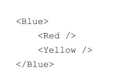

# Building Your First React App: A Tutorial

But first a poetic offering...

```
Today we learn React, 
Virtual DOM, JSX, components.

I hope you all become proponents, 
of props and state. 

Don't be late, 
because today we learn React. 
```

## Learning Objectives

By the end of this lecture you should be able to:

1. Start a React application using `create-react-app`
2. Reason about a React application's component hierarchy
3. Be able to differentiate between JSX and JavaScript

## A Quick Overview of React

React is a library used to build user interfaces (UI). We will be using React to build UI that is displayed in a web browser. We were just introduced to the fundamental concepts of React:

* components written in JSX
* data represented by props and state

At it's core React does one thing: **displays data**. React accomplishes this via components. A single component accepts props as arguments then generates UI based off of this data (i.e.,  props) passed to it.


A React application is comprised of components written in an HTML-like syntax called JSX. JSX is HTML-like [syntactic sugar](https://en.wikipedia.org/wiki/Syntactic_sugar) that allows you to define a tree structure for your components (think DOM tree).

All React **class components**<sup>1</sup> must have a `render()` method. React components are nested inside of one another. A component that is nested inside another component is the child of that component. *UI that appears inside other UI should be the child of the UI it appears in.*

<sup>1</sup>Functional stateless components don't need a `render()` method. More on this later. 



**Quiz**: What is the basic building block of a React application?

A component can not alter its own `props` object. A parent component passes `props` to a child component. `Props` flow downwards - from parent *to* child component. **Props are passed from parent to child component as attributes on JSX**.

React components provide mutable state, but not shared mutable state: **a component can only alter its own state**. On a component's state change, a re-render of the DOM will be automatically triggered. The only way to update state is to call `setState()`.

## What are We Building

We are going to build an application similar to Trello. We will call it React Tracker! Here is a mock-up of our application.


This application is a simple "ticket" management system. It allows users to add tasks to one of three lanes. Each lanes corresponds to a different level of completion for the task described in that ticket. Once a task is created by a user the task is in one of three states:

1. Back Log
2. In Progress
3. Complete

A task moves through the different states from "Back Log" to "In Progress" and "In Progress" to "Complete".

Let me show you a demo of the application.

## A Gentle Tour of React

What follows is a guide for building the application described above. We will go through this tutorial as a class, stopping at various phases to discuss key concepts.

### Initial Configuration

We begin this story as we have begun many others. In order to build a piece of software we typically put all of the code we write into  a directory. We will be using a tool called `create-react-app` to generate this directory.

> Initialize the project using `create-react-app`.

```bash
$ create-react-app react-tracker
```

> Let's navigate into the `react-tracker` directory and start the development server.

```bash
$ cd react-tracker
$ nodemon
```

> Spend 5 minutes looking around the code generated by `create-react-app`. Do you see any code you recognize? Anything in particular you don't recognize?

Navigate to `localhost:3000`. You just made an application using React. Great job!

Let's take a look at the code that `create-react-app` gives us.

A few things to note about the default React application we are given by `create-react-app`:

* In order for our `create-react-app` application to *build*<sup>1</sup> we need:
	- `public/index.html`
	- `src/index.js`
* **Hot module reloading**: When we make changes to our application we don't need to refresh our browser to see them. They just magically appear...WTF!

<sup>1</sup>What do I mean by build? I mean that [webpack](https://webpack.js.org/) takes all of the JSX code and converts it into JavaScript. Other things happen during the build process, but the aforementioned process is the most important.

#### Setting Up Our File Structure

I would like to start off by creating *ALL* directories and files we will need for the entire project. 

**We will be putting all of our code in the `src` directory**.

> Let's modify our `src` directory to look like this:


* `index.js` - Where we will put all of our React code
* `index.css` - Where we will put all of our styles
* `components` - Where we will put all of our components (each one of our components will get its own file)

React is a library so we need to include it inside `index.js`. There are actually two related libraries we need to include.

> Inside `index.js`:

```js
import React, {Component} from 'react';
import ReactDOM from 'react-dom';
import './index.css';
```

`ReactDOM` was originally part of the React library. `ReactDOM` has methods associated with it that allow us to attach our React components to the DOM.

##### ES6 Importing

Up until now we've seen `require` statements as a way to access code written in other files. ES6 has a new syntax for doing this using the `import` keyword. Using the `import` keyword you can import an *entire* module or just a property or method from a module using `{}`. So when we type:

```js
import React, {Component} from 'react';
```

We are importing the entire library as well as a specific method inside the `React` library called `Component`.

#### UI Architecture

**The way to start a React application is to break UI down into components**. Our application can be broken down like this:


Each box represents a React component. From this picture we can derive our component hierarchy. Components in React have a parent-child relationship with each other. There should be a single **root component** that *ALL* components are children of. This **root component** is the most top-level component and will be the component that is rendered to the DOM. In a React application only one component is passed to the `ReactDOM.render()` method and is therefore added to the DOM. In our application `<Board />` will be our top-level component.

```
	<Board /> (Red)
		<AddTask /> (Orange)
		<Lane /> (Green)
		<Lane /> (Green)
		<Lane /> (Green)
```

> Let's create our `<Board />` component and append it to the DOM. For now we will put it inside `index.js` just to make sure we have everything hooked up correctly.

```js
import React, {Component} from 'react';
import ReactDOM from 'react-dom';
import './index.css';

class Board extends Component {
	render() {
		return <div>Hello World</div>
	}
}

ReactDOM.render(<Board />, document.getElementById('root'));
```

All of the HTML code written inside the `render()` method of our class is JSX. JSX is a React-specific language for specifying mark-up in a JavaScript file. You will be writing *a lot* of JSX today.

**All class components must have a render method that returns a single DOM node**.

We just created our first React application. The `ReactDOM.render()` method takes 2 arguments:

1. Our root component
2. The DOM node we are appending our root component to

In `index.html` we have an anchor DOM node with an `id` of `root`.

Let's modify `index.js` to look like this:

```js
import React from 'react';
import ReactDOM from 'react-dom';
import './index.css';
import Board from './components/Board.js';

ReactDOM.render(<Board />, document.getElementById('root'));
```

### Adding State to Our Board Component

Our React application will have some data that it will render. Namely we are representing a list of tasks. Each task will have the following attributes:

* `id` - An unique numerical identifier
* `title` - A task title
* `description` - A task description
* `progressLevel` - The current level of progress on a given task which can be either "backlog", "in-progress" or "complete"

The way we *create* **mutable** data in our React application is with `state`. Mutable data is data that can be created, updated and destroyed. State is *always* created in the `constructor()` method of a React component class. In React `state` is just a JavaScript object.

> Let's start writing our `<Board />` component. We will need to update `index.js` to `import` our `<Board />` component.
Let's also create our initial state.

```js
// import library code
import React, {Component} from 'react';

// import custom components
import Lane from './Lane';
import AddTask from './AddTask';

class Board extends Component {

	constructor() {
		super();

    // We are initializing our state here
		this.state = {
			tasks: [
				{
					"id": 0,
					"title": "Learn React",
					"description": "Build a React application",
					"progressLevel": "backlog"
				},
				{
					"id": 1,
					"title": "Meditate Upon Vue.js",
					"description": "Really cool new framework",
					"progressLevel": "in-progress"
				},
				{
					"id": 2,
					"title": "Write Article About Angular 2",
					"description": "Angular 2 sucks!",
					"progressLevel": "complete"
				}
			],
			currentID: 3,
			newTaskTitle: "",
			newTaskDescription: ""
		};

	};

	// Here we are rendering our 3 lanes
	render() {
		return (
			<div className="board">
				<AddTask updateTask={this.handleNewTaskUpdate}
								 updateDescription={this.handleNewTaskDescription}
								 newSubmission={this.handleNewTaskSubmission}
								 newTitle={this.state.newTaskTitle}
								 newDescription={this.state.newTaskDescription} />
				<Lane tasks={this.state.tasks}
							laneProgressLevel="backlog"
							updateState={this.handleTaskPromotion} />
				<Lane tasks={this.state.tasks}
							laneProgressLevel="in-progress"
							updateState={this.handleTaskPromotion} />
				<Lane tasks={this.state.tasks}
							laneProgressLevel="complete"
							updateState={this.handleTaskPromotion} />
			</div>
		)
	}
}
```

*Let's comment out until we get a working application*.

### Creating a Stateless Functional Lane Component

Let's now create our `<Lane />` component. This component will be what we call a **stateless functional component** and will be a child component of `<Board />`.  A stateless functional component is a component that is written as a function that accepts `props` as a parameter and returns JSX. No state is created in a stateless functional component. Components that only have a `render()` method should be converted into stateless functional components. These components are strictly presentational. Remember that *props* are immutable data that is passed from parent component to child component.

```js
import React from 'react';

// This is our stateless functional Lane component
let Lane = ({tasks, laneProgressLevel, updateState}) => {

	let laneTasks = tasks.filter(task => task.progressLevel === laneProgressLevel).map(task => {
		return (
			<div className="task" key={task.id}>
				<h2>{task.title}</h2>
				<p>{task.description}</p>
				<button onClick={() => {updateState(task.id, task.progressLevel)}}>
					Promote
				</button>
			</div>
		)
	});

	return (
		<div className="lane">
			<h2 className="lane-header">{laneProgressLevel.toUpperCase()}</h2>
			{laneTasks}
		</div>
	)

};

export default Lane;
```
> Let's add some styles to `index.css` so we can see the lanes in our application. We add our styles to `index.css`.

```css
.board {
  max-width: 100%;
}

.lane {
  width: 25%;
  display: inline-block;
}

.task {
  border: 1px solid black;
  margin: 2px;
  padding: 8px;
}

.lane-header {
  text-align: center;
}
```

*Do we have any errors? Let's do some commenting out to get rid of our errors*

### Creating Our Add Task Lane

At this point we have worked on three of our four lanes. Let's now work on the lane that corresponds to adding a task item.

```js
// import library code
import React, {Component} from 'react';

class AddTask extends Component {

	render() {
		return (
			<div className="lane">
				<form onSubmit={(e) => {this.props.newSubmission(e)}}>
					<label>
						Title:
						<input type="text"
									 onChange={(e) => {this.props.updateTask(e)}}
									 value={this.props.newTitle} />
					</label>
					<br/>
					<label>
						Description:
						<input type="text"
									 onChange={(e) => {this.props.updateDescription(e)}}
									 value={this.props.newDescription} />
					</label>
					<input type="submit" value="Submit"  />
				</form>
			</div>
		)
	}

};

export default AddTask;
```

Things to note here:

* We are using React's `onChange` method which is an event listener that executes a function whenever the `value` attribute in a form is changed
* We are also using React's `onSubmit` event listener which executes a function whenever a form is submitted

#### Having Child Components Alter Parent Components' State

There are a variety of methods we need to implement in order to finish our application:

```js
// import library code
import React, {Component} from 'react';

// import custom components
import Lane from './Lane';
import AddTask from './AddTask';

class Board extends Component {

	constructor() {
		super();

    // We are initializing our state here
		this.state = {
			tasks: [
				{
					"id": 0,
					"title": "Learn React",
					"description": "Build a React application",
					"progressLevel": "backlog"
				},
				{
					"id": 1,
					"title": "Meditate Upon Vue.js",
					"description": "Really cool new framework",
					"progressLevel": "in-progress"
				},
				{
					"id": 2,
					"title": "Write Article About Angular 2",
					"description": "Angular 2 sucks!",
					"progressLevel": "complete"
				}
			],
			currentID: 3,
			newTaskTitle: "",
			newTaskDescription: ""
		};

	};

	// This function adds a new task to the tasks array with a progressLevel
	// of backlog
	handleNewTaskSubmission = (e) => {
		e.preventDefault();

		let newTask = {
			id: this.state.currentID,
			title: this.state.newTaskTitle,
			description: this.state.newTaskDescription,
			progressLevel: "backlog"
		}

		this.setState((currentState) => {
			return {
				tasks: [...currentState.tasks, newTask] ,
				newTaskTitle: "",
				newTaskDescription: "",
				currentID: currentState.currentID++
			}
		})

	};

	// This function updates the newTaskTitle property in state
	handleNewTaskUpdate = (e) => {
		e.preventDefault();
		this.setState({
			newTaskTitle: e.target.value
		})
	};

	// This function updates the newTaskDescription property in state
	handleNewTaskDescription = (e) => {
		e.preventDefault();
		this.setState({
			newTaskDescription: e.target.value
		})
	};

	handleTaskPromotion = (taskID, currentState) => {
		let possibleStates = ["backlog","in-progress", "complete", "archived"];
		let taskArrayClone = this.state.tasks.slice();
		let updatedTask = {
			id: taskID,
			title: taskArrayClone[taskID].title,
			description: taskArrayClone[taskID].description,
			progressLevel: taskArrayClone[taskID].progressLevel = possibleStates[possibleStates.indexOf(currentState) + 1]
		}
		taskArrayClone[taskID] = updatedTask;
		this.setState({tasks: taskArrayClone});
	};

	// Here we are rendering our 3 lanes
	render() {
		return (
			<div className="board">
				<AddTask updateTask={this.handleNewTaskUpdate}
								 updateDescription={this.handleNewTaskDescription}
								 newSubmission={this.handleNewTaskSubmission}
								 newTitle={this.state.newTaskTitle}
								 newDescription={this.state.newTaskDescription} />
				<Lane tasks={this.state.tasks}
							laneProgressLevel="backlog"
							updateState={this.handleTaskPromotion} />
				<Lane tasks={this.state.tasks}
							laneProgressLevel="in-progress"
							updateState={this.handleTaskPromotion} />
				<Lane tasks={this.state.tasks}
							laneProgressLevel="complete"
							updateState={this.handleTaskPromotion} />
			</div>
		)
	}

};

export default Board;
```

What's going on here:

* The `handleNewTaskUpdate` and `handleNewTaskDescription` are methods that keep track of the `value` attribute of the `<input>` fields in `AddTask.js`. This is what we call **controlled components**. A **controlled** component is an input field whose value property is always known in state
* We are passing props to child components in the `render()` methods
* React has *NOT shared mutable state* meaning that state can be changed **ONLY** by the component that owns or created the state. This is why we need to write the methods that alter the state on `<Board />` and pass these functions to child components as `props`
* One of the most important methods in React is `setState()`. This is the *ONLY* method we use to update state. It takes an object as its argument corresponding to the key-value pairs of state
* When updating state we should not mutate the previous state, instead we should clone it and update the cloned copy


## In Conclusion

We just built a state-ful React application that exploited the full power of JSX, props and state. We covered a lot of new concepts. One of the things to keep in mind as you continue to learn React is the *why*? React makes enforces a lot of structure in you application and understanding *why* this structure is enforced is the difference between someone who knows how to use React and someone who knows how to use React *well*.
