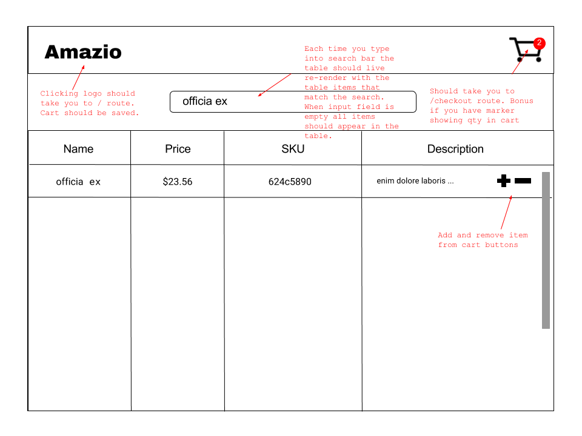
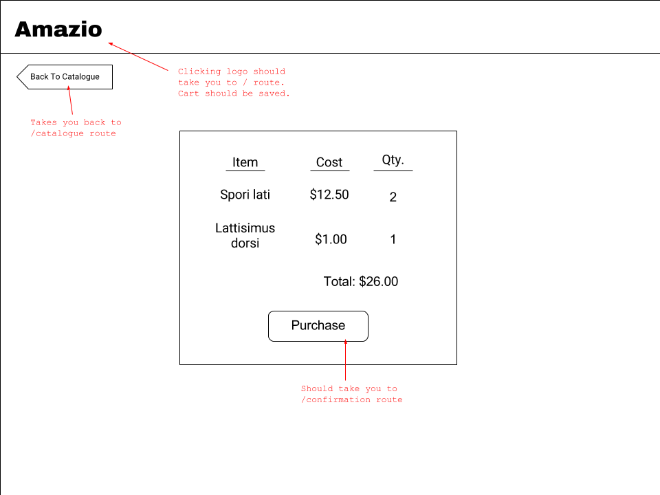
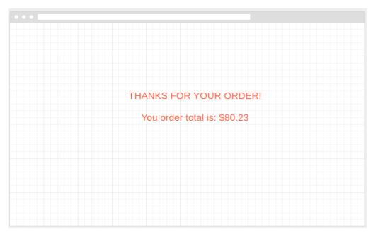

# React Hackathon: Building an E-Commerce Platform 

**Goal**: Take the user stories and wireframes below and build a *full-stack* React application. Technologies that must be used: 

* React
* React Router 
* Express 
* MongoDB/Mongoose

**The product**: You will be building a simple checkout sequence. This will be similar to Amazon in that a user will add catalogue items to a cart. You will then be able to purchase these items. 

**Note**: You DO NOT need to have any concept of a *user* in this application. The only two models you will be creating will be a Products model and an Order model. **You should have a single document in your orders collection**. This application only needs to have a single order in it. All products should be added to this order!

## Application Specifications 

### Project Overview

**Project Name**: amaz.io 

**Summary**: amaz.io is a simple E-commerce checkout platform. There are four views associated with amaz.io: 

* Welcome View: View you visit when you first visit the page that simply takes you to the Catalogue View (i.e., there should be a button that takes you to the Catalogue View)
* Catalogue View: Displays all items in catalogue
* Checkout View: Allows user to purchase items and adjust quantities
* Order Confirmation View: Displays to user a message confirming order.

This application should be a single-page application with 4 routes: 

* `/` - A welcome view that a user first sees when they visit the site. This should be a simple view that takes them the the Catalogue view
* `/catalogue` - The catalogue view should contain a table of items. In this view you should be able to view all items and add them to the cart.
* `/checkout`
* `/confirmation`

## Wireframes and Routes

There should be 4 routes for this application: 

### /catalogue

There should be a `/catalogue` client-side route that corresponds to the following wireframe: 

* The catalogue view should have a table that displays the catalogue items 
* There should be a search field that allows you search catalogue items by name. An item should appear if its name contains any part of the search. For example if you search for an item with name "french" the item with name "french press" should appear. Use `indexOf` to do this.

### /checkout

There should be a `/checkout` client-side route that corresponds to the following wireframe: 

### /order-confirmation

There should be a `/order-confirmation` client-side route that corresponds to the following wireframe:

## User Stories and User Flows 

AAU: 

* In the Catalogue View I want to be able to: 
    - Add an item to my cart by clicking `+`. 
    - Remove an item from my cart by clicking `-`
    - I want to be able to search items **only by name**
    - I want to be able to navigate to the Checkout View by clicking cart icon at the top-right corner 
* In the Checkout View I want to be able to: 
    - View the total of my order
    - I want to be able to navigate back to the Catalogue View 
    - Clicking `Purchase` should take me to my Order Confirmation View 
* In the Order Confirmation View: 
    - I want the order total to be displayed
    
## Data Model 

You should have 2 data models: 

Product Model:

* name (String)
* price (Number)
* description (String)
* sku (String)

Use the data in `sample-data.js` to seed your database.

Order Model:
* products (referencing Product model)

## Good Luck 

This section of the README wishes you the best of luck.

## PS

Design PDFs have been provided to you in the `design-pdfs` directory.
