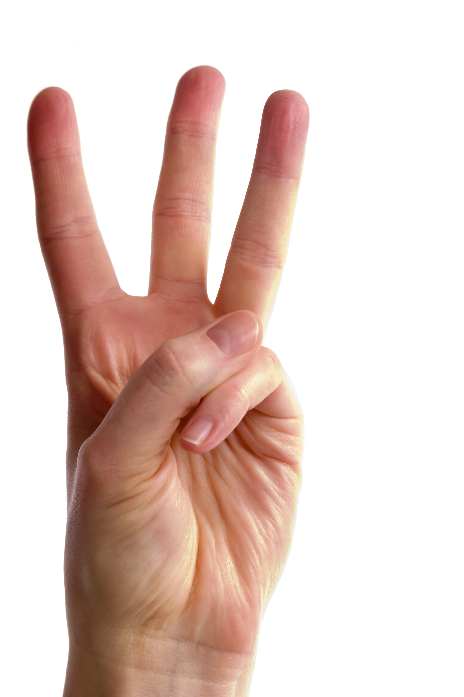
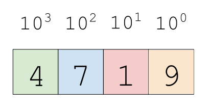

# Introduction to Computer Systems 

## Learning Objectives 

By then end of this lecture you should know: 

* How to represent a number in binary and how to convert from binary to decimal and back again 
* Common Boolean operators on bits and bit strings such as OR, AND, XOR, NAND
* Know how negative numbers are represented in binary using two's complement 
* Understand the relationship between logic gates and Boolean operators 

## Introduction 

**All data on a computer system is represented by 1's and 0's**. Because of this we are going to begin our journey into computer systems with a discussion of binary numbers. Your computer's hardware can do a vast array of logic on these bits using a branch of mathematics called Boolean algebra. Computer hardware is built on electronic circuits. Computers do logic on bi-stable voltages - either high or low voltage and consequently are able to do Boolean logic. We are going to discuss some the the basic rules and operators of Boolean algebra and see how we can use these rules to compute things.

## A Number and Its Representation 

The numbers we see every day (e.g., $5, $3.89/gal, 250 million people live in the US) are representations of some abstract idea: a quantity. We can use different representations to refer to the *same* quantity.

Take a look at the picture below.

<center>
    
</center>

How many fingers do you see? Everyone would agree they see three fingers. The idea of *three-ness* is an abstract idea. We could have three of many things: three eggs, three cookies, three cars, three computers, etc. We can represent that abstract idea of *three* using many different representations: 

```
III (Roman numerals)
3 (decimal)
11 (binary)
3 (hexadecimal)
```

All the above representations refer to the same abstract notion of *three-ness*. **The key here is that there is a difference between the abstract concept of a number and its many different representations**. 

In the most literal sense the following is **NOT** the *quantity* 100: 

<center>
100
</center>

Above is simply pixels on a computer screen forming a familiar symbol!

### A Friendly Face: The Decimal Numbering System 

A **numbering system** is a mechanism we use to *represent* numeric values. We are used to the *decimal* numbering system. Computers use another numbering system called the *binary* numbering system. The binary and decimal numbering systems are both **positional numbering systems**, meaning that the value of a number depends on its *position* (i.e., 10ths-place, 100ths-place, etc) within the overall number. Remember that the binary and decimal numbering systems are all different ways of representing the same abstract ideas of quantities. 

In the decimal numbering system each number to the left of the decimal symbol represents a value between 0 and an increasing power of 10. Let's  break down how the number 4,719 is represented in a decimal numbering format. 

<center>
    
</center>

4,719 can broken down into powers of 10 like this: 

4,719 = 4&times;10<sup>3</sup> + 7&times;10<sup>2</sup> + 1&times;10<sup>1</sup> + 9&times;10<sup>1</sup>

The **base** or **radix** is the number we multiply successive powers by to get the number we want in whatever numbering system we are using. That's why we say the decimal numbering system is base-10.

## Binary Numbers 

With a binary number representation we represent numbers using only 1's and 0's. This maps to high and low voltage in an electronic circuit. Take a look at the table below.

| Binary | Octal | Decimal | Hexadecimal |
|--------|-------|---------|-------------|
| 0000   | 000   | 0       | 0           |
| 0001   | 001   | 1       | 1           |
| 0010   | 002   | 2       | 2           |
| 0011   | 003   | 3       | 3           |
| 0100   | 004   | 4       | 4           |
| 0101   | 005   | 5       | 5           |
| 0110   | 006   | 6       | 6           |
| 0111   | 007   | 7       | 7           |
| 1000   | 010   | 8       | 8           |
| 1001   | 011   | 9       | 9           |
| 1010   | 012   | 10      | A           |
| 1011   | 013   | 11      | B           |
| 1100   | 014   | 12      | C           |
| 1101   | 015   | 13      | D           |
| 1110   | 016   | 14      | E           |
| 1111   | 017   | 15      | F           |

In JavaScript we can denote a binary number by using the `0b` prefix and then writing the actual sequence of 1's and 0's that make up the binary number after it. 

```js
0b10101 //=> Refers to the binary number 10101 
```

To better understand *what* quantity a binary number represents lets convert the number `0b101` to decimal since we are all more familiar conceptualizing decimal numbers than binary numbers: 

1 &times; 2<sup>2</sup> + 0 &times; 2<sup>1</sup> + 1 &times; 2<sup>0</sup> = 5 (in decimal)

The general formula for representing a **positive** binary number is: 

<center>
    
</center>

The formula above, takes a bit string and converts it to a decimal number.

Later on I will provide you a different formula for representing positive *and* negative binary numbers. 

---

#### Exercises:

* Convert `0b1001011` into decimal. 
* Convert `27` into binary. 
* Write a function called `decimalToBinary` that converts a decimal number (base-10) to a binary number (base-2). This function should use a stack, `Math.floor` and the modulo operator (`%`) to do this.
* How can you tell if a binary number is odd or even by looking at only one bit?
* What is the formula that gives us the largest number, in decimal that we can represent with just n-bits?

---

### Bit Strings and Bitwise Operators

You are familiar with the **logical operators** `&&` and `||` in JavaScript. These logical operators have **bitwise operator** analogs in JavaScript that work on bit strings. JavaScript's bitwise operators treat their operands as 32-bit integers and work on the level of the binary representations of numbers.

A **bit string** is a sequence of 1's and 0's. We say that the bit on the left is the **most significant bit** and the bit on the right is the **least significant bit**. A bit string made up of 8 bits is called a **byte**. What is the maximum number - in decimal - we can represent with a single byte?

### Two-Complement Representation of Signed Binary Numbers 

We represent *negative* binary numbers using **two's complement** notation. Here is the formula for converting a binary number written in two's complement to a decimal number: 

<center>
    
</center>

In two's complement notation we simply say that the most significant bit is negative.

---

#### Exercise:

* Convert `0b1001011` into decimal using two's complement. 

---

### Truth Tables for OR, AND, NOT and XOR

We can represent all the different possible operands and operators of bitwise operators with truth tables. Below are the truth tables

| OR | 0 | 1 |    
|----|---|---|
| 0  | 0 | 1 |
| 1  | 1 | 1 |

| AND | 0 | 1 |
|-----|---|---|
| 0   | 0 | 0 |
| 1   | 0 | 1 |

| XOR | 0 | 1 |
|-----|---|---|
| 0   | 0 | 1 |
| 1   | 1 | 0 |

| NOT  | 0 | 1 |
|------|---|---|
|  -   | 1 | 0 |

Each one of the above operators also has a bitwise analog in JS: 

* AND - `&` 
* OR - `|`
* NOT - `~`
* XOR - `^`

We can apply the above operators to bit strings in JS: 

```js
~0b1
0b11 ^ 0b10
0b101 | 0b011
0b111 & 0b000
```

---

#### Exercise:

Lets say you have two arrays. If you convert these arrays to bit strings you can easily use bitwise operators to check the union, intersection, symmetric difference and complement of elements in these arrays.

```js
let a = [0,3,5,6];
let b = [0,2,4,6]; 

let binA = 0b1101001;
let binB = 0b1010101;  
```

* `a & b` where `&` is the intersection `[0,6]`
* `a | b` where `|` is the union `[0,2,3,4,5,6]`
* `a ^ b` where `^` is the symmetric difference `[2,3,4,5]`
* `~a` where `~` is the complement `[2,4]`

---

#### Bitwise Arithmetic 

Just like we add, subtract, multiply and divide decimal numbers to one another we can do the same with binary numbers.

```js
0b101 + 0111
```

##### Case Study: A Half Adder 

You can accomplish arithmetic (e.g., `+`, `-`) using Boolean logic. This is a profound and very important idea! Let's take a look at how we can add two bits together using a XOR-gate and an AND-gate.

<center>
    
</center>

Here is the truth table for our half-adder: 

| A | B | sum | carry |
|---|---|-----|-------|
| 0 | 0 | 0   | 0     |
| 0 | 1 | 1   | 0     |
| 1 | 0 | 1   | 0     |
| 1 | 1 | 1   | 1     |

Note that the carry bit represents an overflow into the next digit of a multi-digit addition.

#### Bit Shifting 

There are different ways we can shift or move over bits: 

* A **left shift**: `x << y`: shift bit-vector `x` left `y` positions
* A **right shift**: `x >> y`: shift bit-vector `x` right `y` positions

Here's an example, 

```
0101 << 2 becomes 010100
```

Why do we care about shifting? Well for one it is an easy way to multiply binary numbers by 2<sup>n</sup>.

```js
5 << 1
5 << 2
0b101 << 2
```